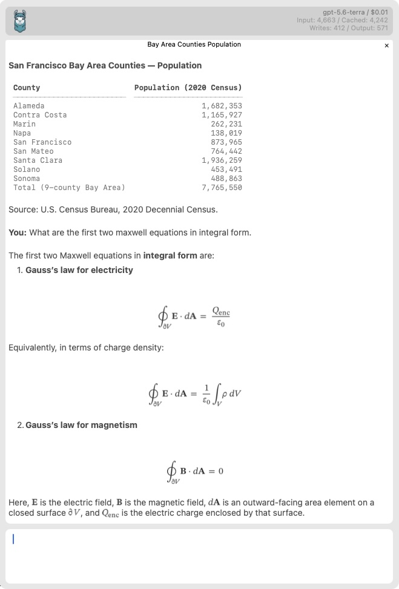

# macAgentic

A native macOS Cocoa UI for [mini-swe-agent](https://github.com/SWE-agent/mini-swe-agent), written entirely in Python with [PyObjC](https://pyobjc.readthedocs.io/).
It renders Markdown and mathematical formulas for polished agent responses.
Model selection and tabs make it easy to switch models and manage multiple conversations.



## Installation

Use [uv](https://docs.astral.sh/uv/) to install dependencies and launch the UI:

```sh
uv sync
uv run python -m macagentic --ui
```

## Tools

macAgentic includes a small set of command-line tools for common agent tasks:

- `gwsx` — access Google Workspace with explicit accounts
- `noteheader` — create meeting-note headers
- `things` — manage Things to-dos
- `websearch` — search the web with Brave Search

## Configuration

Defaults live in `config/config.toml`; override them per user in `~/.config/macagentic/config.toml`.
You can configure:

- `model` — default model
- `models` — fast, medium, and slow model choices
- `openai_api_key` and `brave_api_key` — service credentials
- `custom_prompt` — additional system instructions
- `mounts` — directories exposed to agent workspaces

## Command-line flags

Pass these options when launching `python -m macagentic`:

- `--task-file PATH` / `--spec PATH`
- `--model MODEL`
- `--instructions PATH`
- `--tool-instructions PATH`
- `--ui`
- `--tooloutput`
- `--screenshot PATH`
- `-h` / `--help`

An initial task may also be passed as a positional argument.

## License

macAgentic is licensed under the Apache License 2.0.
